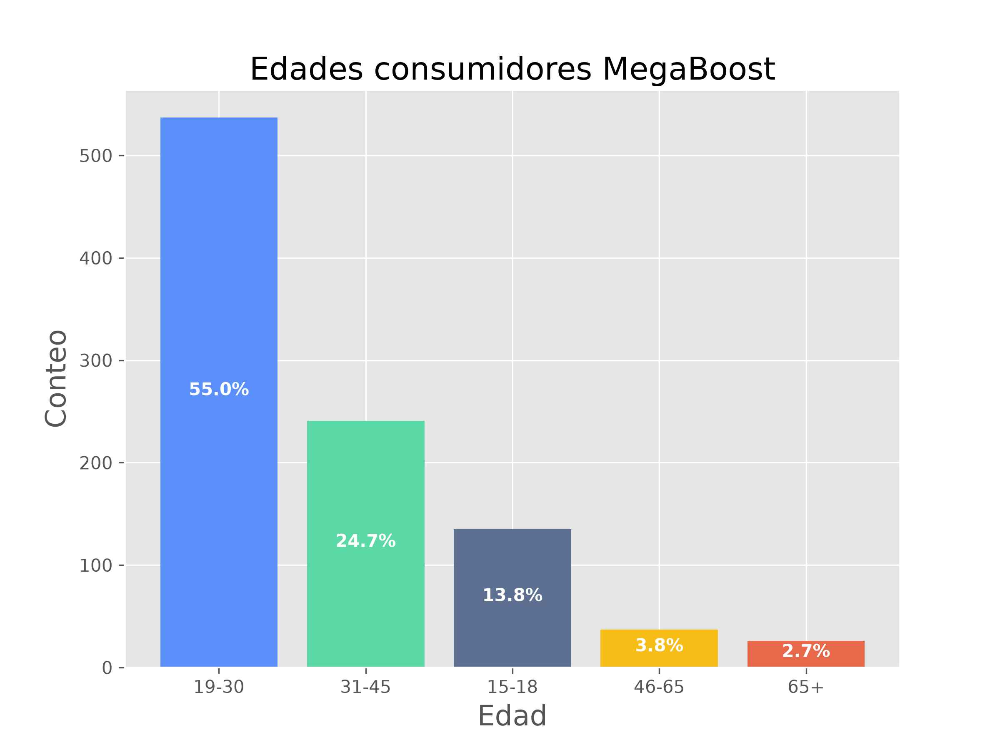
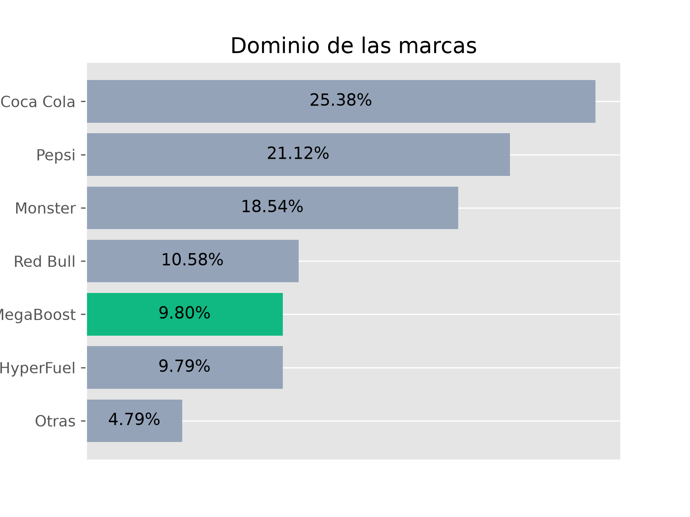
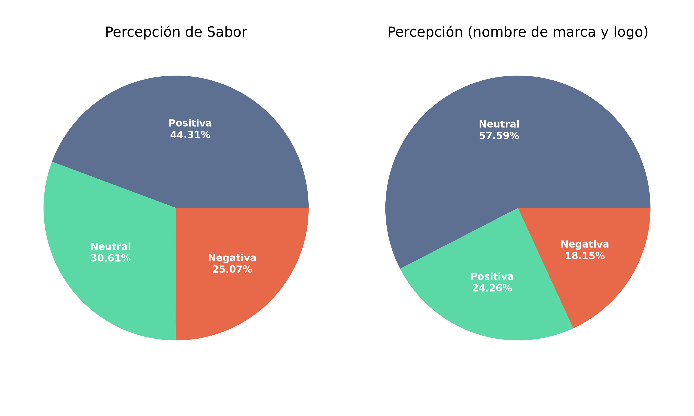
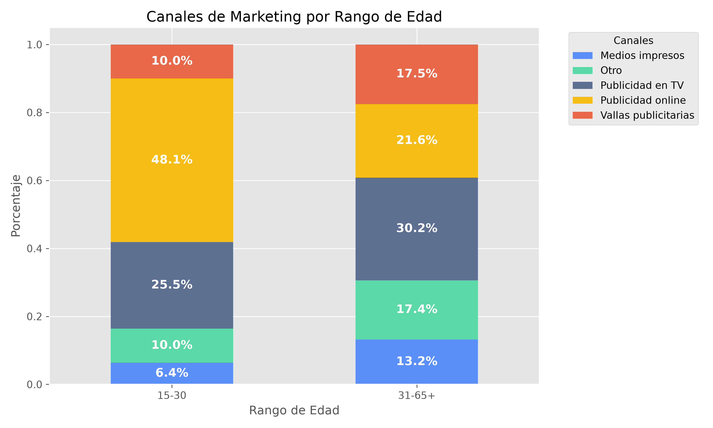

# [Análisis  de datos aplicado a una nueva bebida energizante](Energizantes.ipynb)
## Planteamiento del Problema
MegaBoost es una marca de bebidas energizantes de Inglaterra y desea ingresar al mercado italiano. Hace algunos meses lanzaron su bebida en 10 ciudades de Italia.

El equipo de marketing está a cargo de incrementar el posicionamiento de la marca y la participación en el mercado, además de apoyar el desarrollo del producto. Para esto aplicaron una encuesta a 10.000 personas en esas 10 ciudades.

## Set de datos
- [Formato de encuesta realizada a 10.000 personas](metadata/encuesta_bebida_energizante.pdf)
- [Dataset principal (.csv) con 10.000 respuestas de la encuesta](data/dataset_bebida_energizante.csv)
- [Metadatos con la descripción de la información contenida en el set de datos](metadata/metadatos_dataset_bebida_energizante.txt)

## Metodología
- Tratamiento de datos: Limpieza de nulos, eliminación de duplicados y formateo de tipos de datos con `NumPy` y `Pandas` 
- Análisis exploratorio (EDA): Identificación de patrones de consumo por ciudad y grupo demográfico.
- Visualización: Generación de gráficos analíticos utilizando `Matplotlib`

## Insights
- **Perfil Demográfico:** El género que más consume nuestra bebida son los hombres, y el grupo de edad con más consumidores de nuestro producto es el de 19 a 30 años (55%), seguido por el rango de 31 a 45 años (24.7%)
 

- **Competencia y Posicionamiento:** Los líderes actuales del mercado son Coca-Cola (25.38%), Pepsi (21.12%) y Monster (18.54%), acumulando cerca del 65% de participación. MegaBoost se encuentra en el 5º lugar con un 9.80% de cuota de mercado.

- **Percepción de Marca:**
  - Nuestra marca y logo no generan suficiente recordación en los compradores y los consumidores no están del todo satisfechos con el sabor de la bebida.
  - En 8 de las 10 ciudades italianas con presencia, la gente NO conoce nuestra marca.
  - Los consumidores prefieren otras marcas debido a su reputación, disponibilidad y sabor.
 

- **Canales de Marketing Efectivos:** La publicidad online y la televisión son los medios más efectivos. La publicidad online predomina ampliamente en el rango de 15–30 años (48.1%), mientras que la TV cobra mayor relevancia en el grupo de 31 a 65+ años (30.2%).

